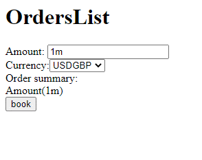

# TypeScript Interview Exercise

To run: 
```
yarn install
yarn start
```

Website runs at `http://localhost:7000`

## Goal
The goal of this exercise is to allow a user to book a simple order from an order entry screen. The basic requirements are:

1. When the user clicks the `Book` button, the screen transitions to show `Booking In Progress`.
1. If the booking succeeds, show a `Booking Success` message.
1. If the booking fails, show a `Booking Failed` message, along with the error message.



## Codebase Overview
* The codebase here is potentially something that a junior / less experienced developer may have worked on. 
* Refactoring is welcome - we will talk through any refactoring that you have made as part of reviewing the solution to the exercise.

## Implementation Notes

* The codebase is Typescript and React. Jest is used for tests.
* State management is handled using a custom solution - there is no need to introduce redux or any other library as part of the solution.
* The backend is stubbed out - there is no need to extend the stub service / implement a real backend

## Constraints
* No modifications to the current list of dependencies in `package.json` are permitted.
